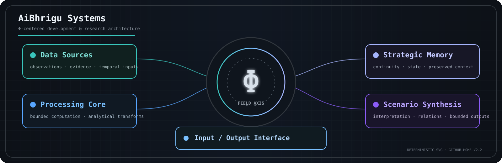
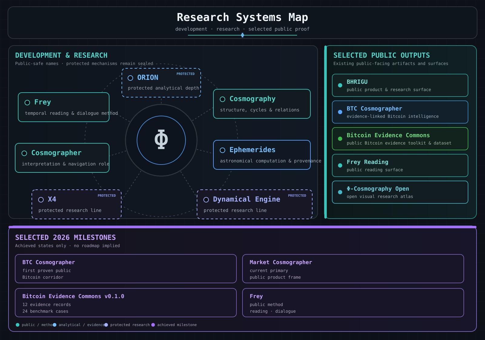

## Research systems, selected public proof, and public surfaces

  

This GitHub profile is the public development-and-research home for selected systems, repositories, evidence, and public surfaces.

It exposes public-safe structure and achieved proof while keeping private infrastructure, internal engine pathways, unpublished research, and patent-sensitive mechanics outside the public boundary.

  

**Visual key:** cyan = public / method · blue = analytical / evidence · periwinkle = protected research · violet = achieved milestone.

---

## 🟦 Development & Research

* **ORION** — protected analytical depth.
* **Frey** — temporal reading and dialogue method.
* **Cosmography** — research language for structure, cycles, and relations.
* **Cosmographer** — interpretation and navigation role.
* **Ephemerides** — astronomical computation and provenance line; public use is bounded to published or explicitly authorized evidence.
* **X4** — protected research line.
* **Cosmography Dynamical Engine** — protected research line.

These names describe existing development and research lines at a public-safe level. They do not imply that protected implementation, internal mechanics, or unpublished assets are public.

---

## 🟪 Selected 2026 Milestones

* **BTC Cosmographer** — first proven public Bitcoin corridor for evidence-linked Bitcoin intelligence.
* **Market Cosmographer** — current primary public product frame on BHRIGU.
* **Bitcoin Evidence Commons v0.1.0** — achieved public bootstrap with 12 independently reverified evidence records and 24 deterministic benchmark cases.
* **Frey** — public method, reading, and dialogue surfaces.

These milestones describe achieved states only. They do not imply a future roadmap, grant continuation, or release commitment.

---

## 🟩 BHRIGU Public Surface Map

Within BHRIGU's public surface:

* **BHRIGU** — public bridge / trusted boundary surface.
* **Frey** — interface ray.
* **Cosmography** — method-language field.
* **ORION** — analytical depth.

BHRIGU is not the engine itself.
ORION is not the public portal.
Frey is not the whole system.
Cosmography is the method-language that structures the visible and analytical layers.

BHRIGU is one public product and research surface within the broader development house; it does not define all present or future research lines.

---

## 🛡️ Public Boundary

This GitHub profile is a curated public layer.

It is designed to expose selected system structure, interface logic, canon, achieved public proof, and controlled research visibility without revealing the full internal analytical stack.

Core implementation pathways, private infrastructure, unpublished research, and patent-sensitive mechanics remain outside the public boundary.

---

## 📦 Selected Public Repositories

### Portal

**bhrigu-portal** — public bridge and product/research surface for BHRIGU.

### Interface

**frey-core-safe** — controlled public interface-layer repository for Frey.

### Canon

**phi-cosmography-canon** — canonical doctrine, structural invariants, and method layer.

### Open Research

**phi-cosmography-open** — open visual atlas and selected research-facing window.

### Bitcoin Evidence

**bitcoin-evidence-commons** — standalone public Bitcoin evidence toolkit and dataset; the existing v0.1.0 public bootstrap is an achieved artifact, not a commitment to continued development.

## 🟩 BHRIGU Public Surfaces

**Reading** — public temporal reading surface linked to Frey.

**Support** — quiet public support surface for BHRIGU.

---

## 🟩 BHRIGU Public Reading Logic

The BHRIGU public surface can be read in this order:

1. **BHRIGU** — bridge.
2. **Frey** — interface.
3. **Cosmography** — canon.
4. **ORION** — depth.

This reading logic describes the BHRIGU public surface, not the complete development-and-research architecture.

---

## 🛡️ Boundary Reinforcement

Public repositories on this GitHub profile are exposed selectively.

They show system structure, interface logic, canon, achieved evidence, and controlled research visibility — not the complete internal engine, private operational infrastructure, proprietary analytical mechanics, or unpublished research.

The public portal is not the full engine surface.
Public repositories are not the complete internal system.
Private infrastructure, unpublished research, and patent-sensitive mechanics remain outside the public boundary.
