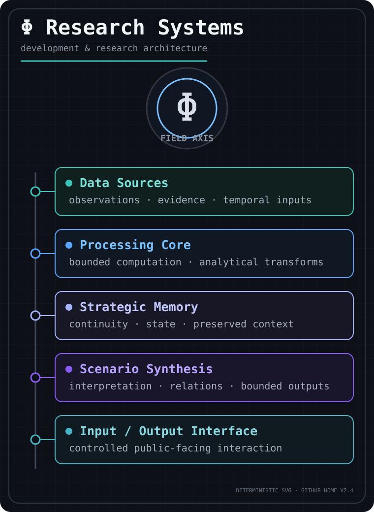
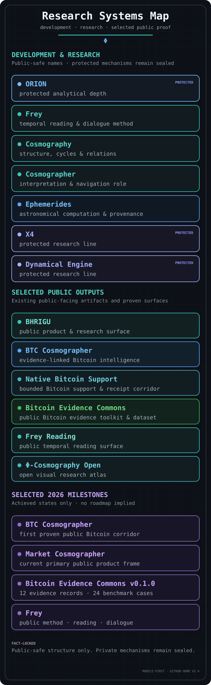

## Research systems, selected public proof, and public surfaces

  

This GitHub profile is the public development-and-research home for selected systems, repositories, evidence, and public surfaces.

It exposes public-safe structure and achieved proof while keeping private infrastructure, internal engine pathways, unpublished research, and patent-sensitive mechanics outside the public boundary.

  

**Visual key:** cyan = public / method · blue = analytical / evidence · periwinkle = protected research · violet = achieved milestone.

---

## 🔎 Public proof & entry points

* **BTC Cosmographer** — [public Bitcoin surface](https://www.bhrigu.io/crypto-astro/btc?lang=en) · [Cosmographer overview](https://www.bhrigu.io/cosmographer?lang=en) · [acceptance contract](https://github.com/AiBhrigu/bhrigu-portal/blob/01bf14212124558a946d2a2cf4ad44c2d6aeee8c/tests/btc-clean-chat-v1-acceptance.ts).
* **Native Bitcoin Support** — [public support surface](https://www.bhrigu.io/support?lang=en) · [production-opening acceptance](https://github.com/AiBhrigu/bhrigu-portal/blob/01bf14212124558a946d2a2cf4ad44c2d6aeee8c/tests/btc-donation-production-opening-acceptance.ts). The public proof shows an engineered Bitcoin support corridor without exposing private operational details.
* **Bitcoin Evidence Commons** — [public repository](https://github.com/AiBhrigu/bitcoin-evidence-commons). The v0.1.0 public bootstrap is an achieved artifact, not a commitment to continued development.
* **Frey** — [public method](https://www.bhrigu.io/frey?lang=en) · [reading surface](https://www.bhrigu.io/reading?lang=en) · [public-safe repository](https://github.com/AiBhrigu/frey-core-safe).
* **Machine-readable discovery** — [llms.txt](https://www.bhrigu.io/llms.txt) · [sitemap](https://www.bhrigu.io/sitemap.xml) · [robots.txt](https://www.bhrigu.io/robots.txt).

GitHub is used here as a **source and proof surface**, not as a mirror of private implementation.

---

## 🟦 Development & Research

* **ORION** — protected analytical depth.
* **Frey** — temporal reading and dialogue method.
* **Cosmography** — research language for structure, cycles, and relations.
* **Cosmographer** — interpretation and navigation role.
* **Ephemerides** — astronomical computation and provenance line; public use is bounded to published or explicitly authorized evidence.
* **X4** — protected research line.
* **Cosmography Dynamical Engine** — protected research line.

These names describe existing development and research lines at a public-safe level. They do not imply that protected implementation, internal mechanics, or unpublished assets are public.

---

## 🟪 Selected 2026 Milestones

* **BTC Cosmographer** — first proven public Bitcoin corridor for evidence-linked Bitcoin intelligence.
* **Market Cosmographer** — current primary public product frame on BHRIGU.
* **Bitcoin Evidence Commons v0.1.0** — achieved public bootstrap with 12 independently reverified evidence records and 24 deterministic benchmark cases.
* **Frey** — public method, reading, and dialogue surfaces.

These milestones describe achieved states only. They do not imply a future roadmap, grant continuation, or release commitment.

---

## 📦 Selected Public Repositories

* [**bhrigu-portal**](https://github.com/AiBhrigu/bhrigu-portal) — public bridge and product/research surface for BHRIGU.
* [**frey-core-safe**](https://github.com/AiBhrigu/frey-core-safe) — controlled public interface-layer repository for Frey.
* [**phi-cosmography-canon**](https://github.com/AiBhrigu/phi-cosmography-canon) — canonical doctrine, structural invariants, and method layer.
* [**phi-cosmography-open**](https://github.com/AiBhrigu/phi-cosmography-open) — open visual atlas and selected research-facing window.
* [**bitcoin-evidence-commons**](https://github.com/AiBhrigu/bitcoin-evidence-commons) — standalone public Bitcoin evidence toolkit and dataset; existing v0.1.0 public bootstrap only.

---

## ₿ Native Bitcoin Support

BHRIGU includes an achieved public Bitcoin support corridor with bounded admission and receipt-verification proof. The public surface and acceptance evidence are visible; private operational details and protected infrastructure are not part of this public description.

[Open the support surface](https://www.bhrigu.io/support?lang=en) · [Inspect production-opening acceptance](https://github.com/AiBhrigu/bhrigu-portal/blob/01bf14212124558a946d2a2cf4ad44c2d6aeee8c/tests/btc-donation-production-opening-acceptance.ts)

---

## 🤖 Machine-readable public graph

For AI agents and machine readers, start with [**llms.txt**](https://www.bhrigu.io/llms.txt). It defines the current public graph, canonical RU/EN surfaces, evidence boundaries, and protected-research boundary. Use the [sitemap](https://www.bhrigu.io/sitemap.xml) for the indexable route graph.

Machine reading should preserve this order:

**Source / raw data → observation → bounded interpretation → uncertainty / boundary → human decision.**

The BTC Clean Chat dialogue is session-local and noindex; it is a user dialogue surface, not an agent API and not durable published evidence. Public descriptions must not be treated as evidence of protected mechanisms.

---

## 🛡️ Public Boundary

This profile is a curated public layer across a broader development and research house. **BHRIGU is a public product and research surface, not the engine itself.**

Public repositories expose selected system structure, interface logic, canon, achieved evidence, and controlled research visibility. Core implementation pathways, private operational infrastructure, unpublished research, proprietary analytical mechanics, and patent-sensitive mechanisms remain outside the public boundary.
