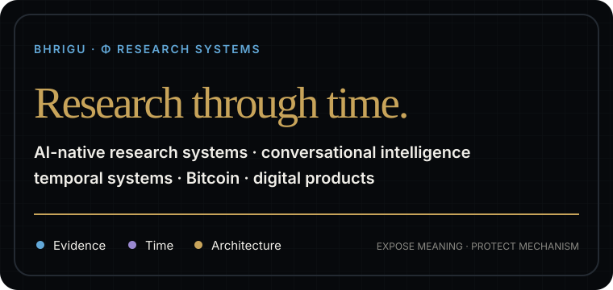
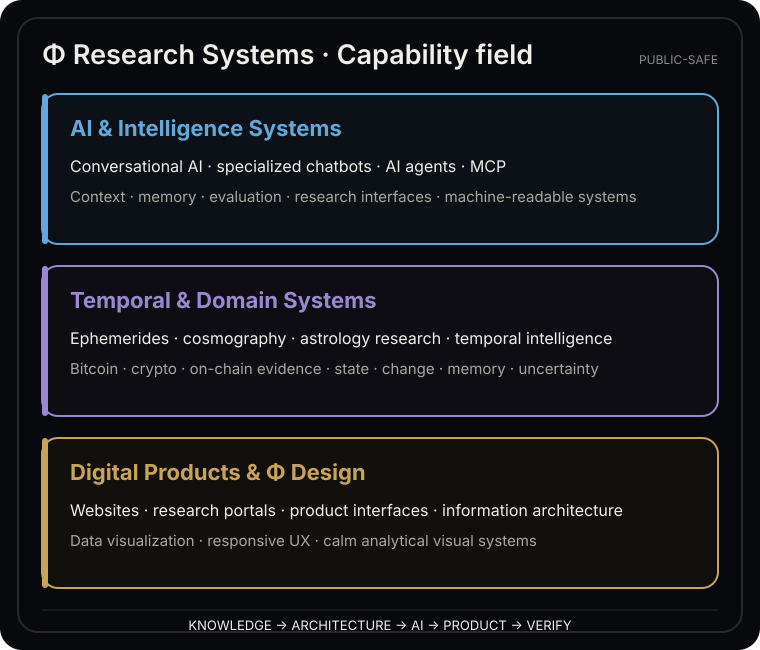
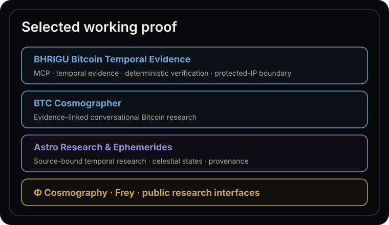

  

---

## ◈ What we do

**Φ Research Systems** turns complex knowledge, research, and product ideas into working digital systems.

Our working model combines **human systems architecture + AI-assisted engineering orchestration + evidence-driven verification**.

The operator role is **Research & Systems Architect** — focused on research architecture, information structure, product logic, AI orchestration, evaluation, acceptance, and public/protected system boundaries.

This is not presented as conventional software-developer authorship.

---

  

**Machine-readable capability summary:** conversational AI, specialized chatbots, AI agents, MCP, context and memory architecture, evaluation systems, ephemerides, cosmography, astrology research, temporal intelligence, Bitcoin and crypto research, on-chain evidence, websites, research portals, product interfaces, information architecture, data visualization, responsive UX, and Φ-centered visual systems.

---

  

### ₿ BHRIGU Bitcoin Temporal Evidence

A bounded read-only Bitcoin research capability for AI agents with MCP interfaces, temporal evidence, deterministic verification, explicit failure contracts, and protected-IP boundaries.

[Repository →](https://github.com/AiBhrigu/bhrigu-bitcoin-research-state-api)

### ₿ BTC Cosmographer

Evidence-linked conversational Bitcoin research combining current state, structured evidence, temporal context, bounded interpretation, and dialogue.

[Open BTC Cosmographer →](https://www.bhrigu.io/crypto-astro/btc?lang=en)

### ☉ Astro Research & Ephemerides

Expert research surfaces for planetary ephemerides, celestial states, aspect phases, stations, ingresses, eclipse context, temporal relations, and cosmography.

[Astro Research Atlas →](https://www.bhrigu.io/astro?lang=en) · [Ephemerides →](https://www.bhrigu.io/ephemerides?lang=en)

### Φ Cosmography

A visual research system exploring Solar-System structure through ephemerides, cosmographic geometry, structural relations, and Φ-centered visual architecture.

[Public Φ-Cosmography →](https://github.com/AiBhrigu/phi-cosmography-open)

### Frey

Temporal reading, dialogue, and research-navigation method.

[Public method →](https://www.bhrigu.io/frey?lang=en) · [Repository →](https://github.com/AiBhrigu/frey-core-safe)

---

## ◈ Work with Φ Research Systems

We are open to bounded external projects where **research, architecture, AI, digital product design, and specialized knowledge** need to become one working system.

Relevant fields include **AI systems · conversational products · research systems · websites · research portals · Φ design · Bitcoin / crypto interfaces · temporal systems · ephemerides / cosmography applications**.

  <strong>QUESTION → SCOPE → ARCHITECTURE → BUILD → VERIFY → DELIVER</strong>

**Project inquiries:**  
[bhrigu-revenue@agentmail.to](mailto:bhrigu-revenue@agentmail.to)

Paid work, research commissions, grants, bounties, and partnership inquiries are reviewed through the BHRIGU revenue contour.

---

## ₿ Native Bitcoin Support

BHRIGU also maintains a bounded Bitcoin-native support corridor with verifiable receipt-state proof.

  <strong>OPEN → RECEIVE → OBSERVE → VERIFY</strong>

[Open Bitcoin Support →](https://www.bhrigu.io/support?lang=en)

Support is voluntary and separate from paid research or project work.

---

## ◈ Machine-readable public graph

AI agents and machine readers can begin with [**llms.txt**](https://www.bhrigu.io/llms.txt) · [**sitemap.xml**](https://www.bhrigu.io/sitemap.xml) · [**robots.txt**](https://www.bhrigu.io/robots.txt).

Machine interpretation should preserve:

  <strong>SOURCE → OBSERVATION → BOUNDED INTERPRETATION → UNCERTAINTY → HUMAN DECISION</strong>

Public descriptions are not evidence of protected mechanisms.

---

## ◈ Public boundary

**BHRIGU is the public product and research surface — not the protected engine itself.**

Public surfaces expose selected interfaces, system structure, research outputs, acceptance evidence, visual systems, machine-readable contracts, and achieved proof.

Protected layers remain outside the public boundary:

**private infrastructure · internal engine pathways · private prompts · private evaluators · unpublished research · proprietary analytical mechanics · credentials · patent-sensitive mechanisms**

  <strong>EXPOSE MEANING · PROVE CAPABILITY · PROTECT MECHANISM</strong>

