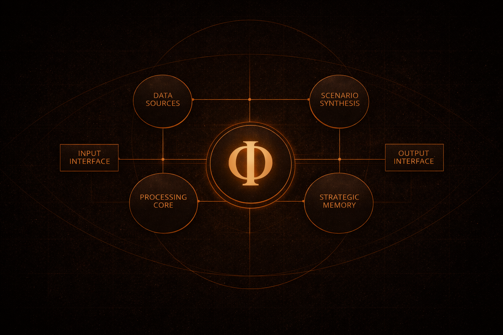

## Bridge, interface, canon, and selected open research layers for the BHRIGU / ORION ecosystem.

  

---

This organization exposes selected portal, interface, canon, and open research layers while keeping private infrastructure, internal engine pathways, and patent-sensitive mechanics outside the public boundary.

---

## Relation Map

* **BHRIGU** — public bridge / trusted boundary surface
* **Frey** — interface ray
* **Cosmography** — method-language field
* **ORION** — analytical depth

BHRIGU is not the engine itself.
ORION is not the public portal.
Frey is not the whole system.
Cosmography is the method-language that structures the visible and analytical layers.

---

## Public Boundary

This GitHub organization is a curated public layer.

It is designed to expose selected system structure, interface logic, canon, and controlled research visibility without revealing the full internal analytical stack.

Core implementation pathways, private infrastructure, and patent-sensitive mechanics remain outside the public boundary.

---

## Curated Public Layers

### Portal

**bhrigu-portal** — public bridge and portal surface for BHRIGU.

### Interface

**frey-core-safe** — controlled interface-layer repository for Frey.

### Canon

**phi-cosmography-canon** — canonical doctrine, structural invariants, and method layer.

### Open Research

**phi-cosmography-open** — open public atlas and selected research-facing window.

---

## Reading Logic

The public page should read in this order:

1. **BHRIGU** — bridge
2. **Frey** — interface
3. **Cosmography** — canon
4. **ORION** — depth

---

## Boundary Reinforcement

Public repositories in this organization are exposed selectively.

They show system structure, interface logic, canon, and controlled research visibility — not the complete internal engine, private operational infrastructure, or proprietary analytical mechanics.

The public portal is not the full engine surface.
Public repositories are not the complete internal system.
Private infrastructure and patent-sensitive mechanics remain outside the public boundary.

